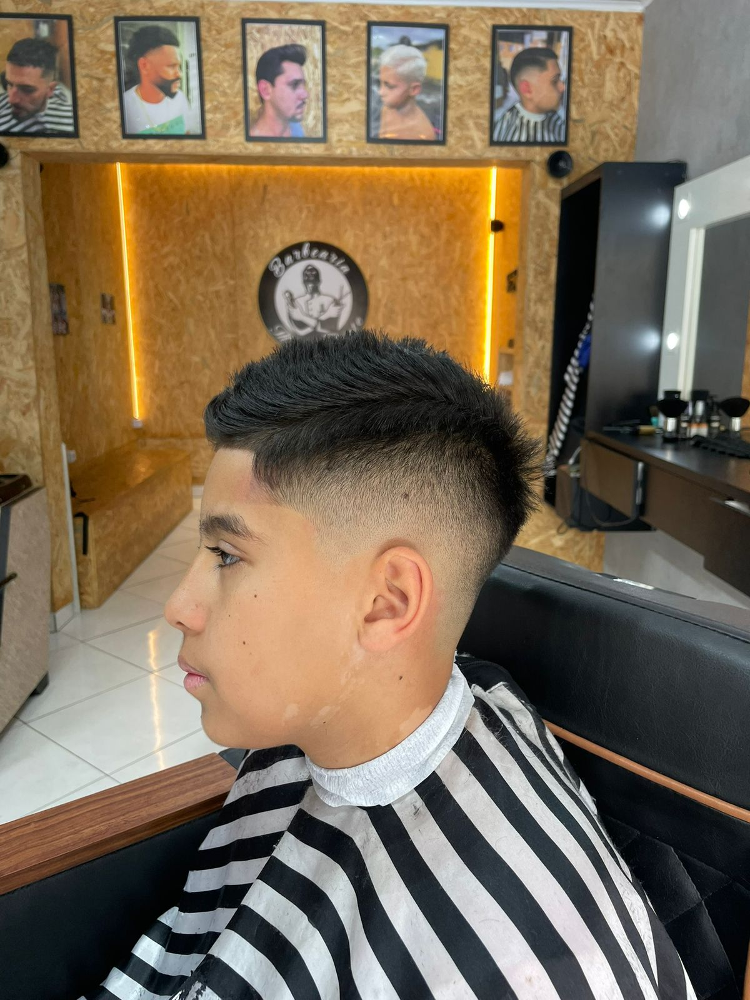

# Barbearia TK DU CORTE — Guia do Projeto

<p align="center">
  
</p>
<p align="center">
  
</p>
<p align="center">
  <a href="https://cashbarber.com.br/barbeariatkducorte" target="_blank">
    
  </a>
</p>

Site institucional com foco em agendamento externo, conteúdo visual e experiência simples. Este guia traz um panorama técnico e instruções práticas para edição e publicação.

## Sumário
- Visão Geral
- Principais Funcionalidades
- Arquitetura e Estrutura de Pastas
- Publicação no GitHub (e Pages)
- Guia de Edição Rápida (“Como editar”)
- Referências a trechos do código
- Animações e Visual
- Melhorias futuras sugeridas

## Visão Geral
- Single Page com seções: Hero, Assinatura, Estrutura (vídeo), Equipe, Galeria, Agendamento e Rodapé.
- Substituição de login/cadastro por agendamento externo via CashBarber.
- Comentários em português em HTML/CSS/JS para facilitar a manutenção.

## Principais Funcionalidades
- Agendamento externo (CTA no topo e seção): `c:\Users\allex\Desktop\tested2\index.html:21` e `index.html:120–132`
- Slider da Assinatura com prev/next, auto‑play e abas: `index.html:42–47`, `index.html:66–71`; `c:\Users\allex\Desktop\tested2\script.js:34–56`
- Galeria de cortes com troca automática e pré‑carregamento: `index.html:111–116`; `c:\Users\allex\Desktop\tested2\script.js:23–41`
- Modal de vídeo que pausa ao fechar: `index.html:154–159`; `c:\Users\allex\Desktop\tested2\script.js:28–33`
- Navegação com rolagem suave e estado ativo: `c:\Users\allex\Desktop\tested2\script.js:1–13`
- Imagens decorativas com opacidade: lâmina na assinatura `index.html:72–73`; estilos `c:\Users\allex\Desktop\tested2\styles.css:133–136`

<details>
  <summary>Prévia visual (clique para expandir)</summary>

  <p align="center">
    
  </p>
  <p align="center">
    
    
  </p>
  <p align="center">
    
    
    
  </p>
</details>

## Arquitetura e Estrutura de Pastas
- `index.html` — marcação principal com seções e comentários “Como editar”.
- `styles.css` — estilos globais, overlay, seções com fundo, slider, cartões e responsivo.
- `script.js` — navegação (menu/rolagem), galeria automática, modal de vídeo, slider da assinatura.
- `imagens/` — assets (fundos, cortes, profissionais, vídeo mp4, decorativos).
- `fonts/` — fontes Rocket Thunder usadas em títulos.

<!-- seção "Como Rodar Localmente" removida a pedido -->

## Publicação no GitHub
```bash
git init
git branch -M main
git remote add origin https://github.com/<usuario>/<repo>.git
git add .
git commit -m "Site TK DU CORTE: agendamento, slider, galeria, modal"
git push -u origin main
```

### GitHub Pages (opcional)
1) No repositório, Settings → Pages → Branch: `main` → `/root` → Save
2) Acesse a URL gerada. Se desejar uma branch dedicada:
```bash
git checkout --orphan gh-pages
git rm -rf .
cp -r c:/Users/allex/Desktop/tested2/* .
git add .
git commit -m "Publicar site"
git push -u origin gh-pages
```

## Guia de Edição Rápida (“Como editar”)
- Hero (título/CTA): `c:\Users\allex\Desktop\tested2\index.html:27–33`
- Assinatura (texto/abas/slider): `index.html:36–74`, `66–71`
- Estrutura (vídeo src): `index.html:82–84`
- Equipe (imagens e nomes): `index.html:95–102`
- Galeria (imagens corte‑1…corte‑20): `index.html:112–116`; intervalo de troca em `script.js:25`
- Agendamento (texto e link): `index.html:125–129`
- Fundos por seção: `c:\Users\allex\Desktop\tested2\styles.css:39–43`
- Overlay (opacidade): `styles.css:37–38`

## Referências a trechos do código
- Navegação com rolagem e estado ativo: `c:\Users\allex\Desktop\tested2\script.js:10–13`
- Slider (auto‑play 5s, prev/next, abas, teclado): `script.js:34–56`
- Modal promocional (pausa ao fechar): `script.js:28–33`
- Decoração lateral com opacidade: `styles.css:133–136`, `137–140`

## Animações e Visual
- Cabeçalho do README com animação de digitação (SVG): tipografia e frases animadas.
- Emojis e ícones para reforçar ações: 💈 ✂️ 🧔‍♂️ ✨
- Efeito de transição nas imagens da Galeria via `script.js` (classe `fade`).
- Slider com auto‑play, controle por abas e teclas — experiência fluida.
 - Badges animados e banner ondulado no README para destacar ações.

## Melhorias futuras sugeridas
- Otimizar imagens (WebP/AVIF) e lazy‑loading.
- Adicionar testes de acessibilidade (contraste/alt/tamanho de fonte).
- Internacionalização básica (pt‑BR/en). 
- Automatizar deploy (GitHub Actions) para Pages.

<p align="center">
  
</p>
